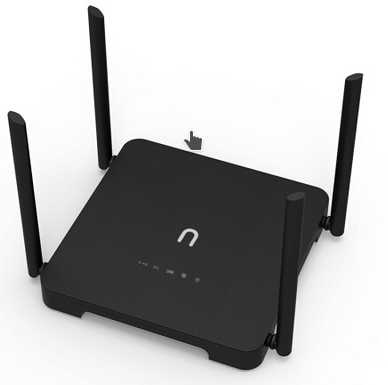
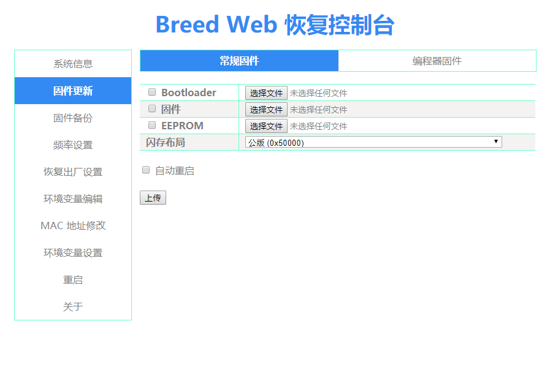
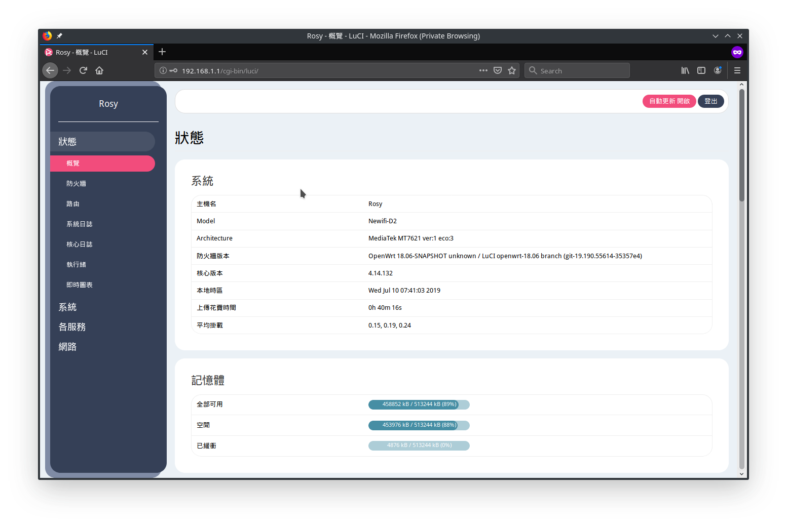

# Newifi3-d2 Firmware Upgrade



## 前言

這篇會分開做兩個部分，第一部分是`更新Breed固件`，第二部分是`編譯&刷入Openwrt固件`。這部機現在應該買不到行貨了，入手時（2019年5月）都已經是推出了好一陣子，是用鄰國淘寶入手的。當時大減價用了149 HKD（131 CNY含運費）入手了98%新的Newifi3-D2 Router。之所以大減價大致上有兩個原因：其一，舊品二手機；其二，這部機曾用於掘礦（例如BonusCloud）。不論如何，購入礦難機都有一定的風險。

關於Newifi3-D2這部Router的Specification，官方網站沒多少資料，建議還是直接看[Openwrt Project Newifi3-D2](https://openwrt.org/toh/hwdata/d-team/d-team_newifi_d2)。無論刷哪一款Router都好，有幾個參數一定要留意：

- Target ：<span style="color:red">ramips</span>
- Subtarget ：<span style="color:red">mt7621</span>
- CPU ：<span style="color:red">MediaTek MT7621 AT</span>
- WLAN HW ：<span style="color:red">MediaTek MT7603EN, MediaTek MT7612EN</span>

在編譯Openwrt需要設定以上參數。詳細會在編譯固件部分說明。


## 一、刷入Breed

本身Newifi3-D2的bootloader為u-boot，不支援線上更新固件，沒有Web interface；簡而言之就是一個非常簡單的一個for Linux 的 bootloader。Breed同樣也是bootloader，不過重點是__支援Web線上刷機__，簡直就是為Router而設計。值得一提的是[Breed](https://www.right.com.cn/forum/thread-161906-1-1.html)並不是Open Source的，是否安全請自行斟酌。


1. 接下來要用ssh去把Breed放到Router的FS中，所以請確定ssh已經開啟：

```shell
在Browser訪問`http://192.168.99.1/newifi/ifiwen_hss.html` ， 如果顯示"Success"表示ssh已開啟。
```


2. 在本repo的folder `/newifi-d2-breed`中找到`newifi-d2-jail-break.ko` （這個就是Breed的二進制bootloader module），用scp 抄寫到Router之中：

```bash
# root的password為管理員password
# 未設定的話可以訪問192.168.99.1（管理頁面）設定
scp ./newifi-d2-breed/newifi-d2-jail-break.ko  root@192.168.99.1:/tmp 
```


3. ssh remote login到router，然後加載Breed Module到Kernel:

```bash
ssh root@192.168.99.1
cd /tmp
insmod ./newifi-d2-jail-break.ko

# ssh 之後應該會no response，這是正常的，因為newifi-d2-jail-break.ko會停止其它系統功能強制寫入Breed bootloader到Flash，完成寫入後Router會自動重啟，所以等一下就好：D
```

<font size="2px">* 順帶一提`/official-firmware-backup` 當中有EEPROM 跟official newifi3-d2 固件的backup。不喜歡的話可以再刷回去。</font>


5. 重啟後不用理，直接關電源。接下來要進入Breed刷機模式。進入方法為：關電的情況下長按住Router背面的`RESET`鍵打開電源，成功的話會看到所有LED會很快的閃動4下。訪問 **http://192.168.1.1** 進入Breed Web Interface。
   


## 二、刷入OpenWrt

這一步很簡單。刷入Breed後訪問Breed（**http://192.168.1.1** )，然後選"固件更新" &rarr; "回件" &rarr; "選擇文件"

你可以選擇：

1. 自已編譯的OpenWrt固件

2. 最基本的OpenWrt固件
   <span style="color:green">`/openwrt-firmware/openwrt-18.06.4-ramips-mt7621-d-team_newifi-d2-squashfs-sysupgrade.bin`</span>
3. 我的custom OpenWrt固件
   <span style="color:fuchsia">`/openwrt-firmware/openwrt-ramips-mt7621-d-team_newifi-d2-squashfs-sysupgrade_sawa_custom.bin`</span>

   

  完成。基本上OpenWrt現在就能用了。


## 三、自定義&編譯OpenWrt

有兩個版本可以選擇，其一是[OpenWrt 18.06](https://github.com/openwrt/openwrt/tree/openwrt-18.06)，另一個是[LEDE](https://github.com/lede-project/source)。

我自己就選擇了用OpenWrt（LEDE是OpenWrt的分支）。


### 1. Clone Source Code

```bash
git clone https://github.com/openwrt/openwrt/tree/openwrt-18.06
cd openwrt-openwrt-18.06
```

   


### 2. Install the LuCI Plugin

#### LuCI - Rosy theme



```bash
nvim ./feeds.conf.default

# Append LuCi source and save
src-git rosy https://github.com/rosywrt/luci-theme-rosy.git;openwrt-18.06

# Install packages definitions
./scripts/feeds update luci
./scripts/feeds install -a -p luci
```

   


### 3. Config OpenWrt

開啟OpenWrt編譯選單：

```shell
make menuconfig
```

- Target System &rarr; MediaTek Ralink MIPS
- Subtarget &rarr; MT7621 based boards
- Target Profile &rarr; Newifi D2
- LuCI &rarr; Collections &rarr; luci
- LuCI&rarr;Modules&rarr;Translations&rarr; Taiwanese (zh-tw)
- LuCI&rarr;Applications&rarr;你想用的應用（如luci-app-aria2，luci-app-ddns，luci-app-adblock）

​    

​    

### 4. Compile!

```shell
make download # just wait
make -j4 # just wait again

#The compiled firmware locate in 
`bin/targets/ramips/mt7621/openwrt-ramips-mt7621-d-team_newifi-d2-squashfs-sysupgrade.bin`
```

編譯好後再用Breed Web Interface刷入固件。完成。


